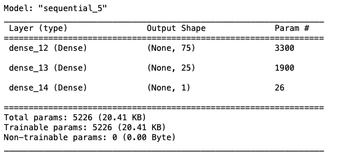
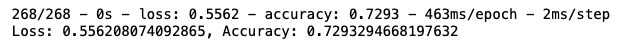
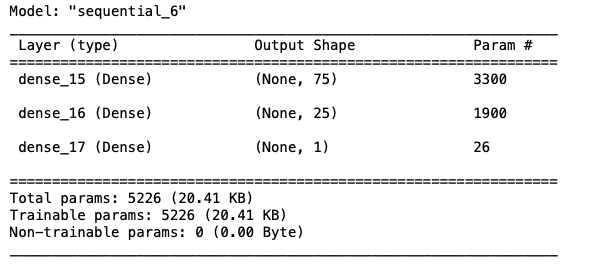
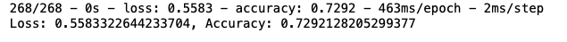
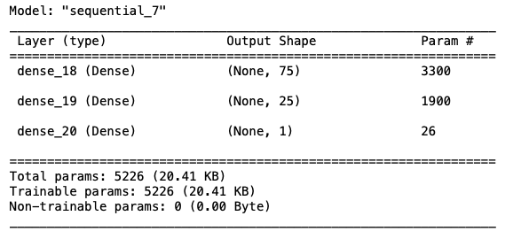
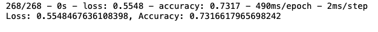
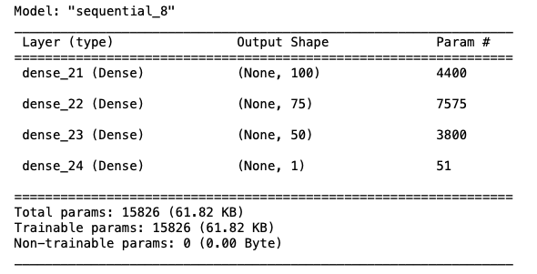
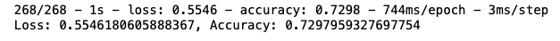

# deep-learning-challenge

# Overview

This evaluation requires designing a neural network (deep learning model) to predict if an organization funded by Alphabet Soup will be successful based on a selection of variables about the organization. 

# Results

The data was cleaned prior to application of the model. The target variable was the column Is_Sucessful. There are 43 features retained in the data. Variables that should be removed from the data are columns where all rows are false or all rows are true.

The model was run and evaluated, with three optimizations performed. The results are discussed below.

The inital model parameters:   
    Hidden layers: 2   
    Neurons by layer: 75, 25   
    Activation function (hidden): relu   
    Activation function (outer): sigmoid   
    Loss: 0.5562   
    Accuracy: 0.7293   

Optimization 1: changed activation function   
    Hidden layers: 2   
    Neurons by layer: 75, 25   
    Activation function (hidden): tanh   
    Activation function (outer): sigmoid   
    Loss: 0.5583   
    Accuracy: 0.7292   

  

Optimization 2: changed activation function   
    Hidden layers: 2   
    Neurons by layer: 75, 25   
    Activation function (hidden): sigmoid   
    Activation function (outer): sigmoid   
    Loss: 0.5548   
    Accuracy: 0.7317       
 
  

Optimization 3: sigmoid activation function with added hidden layer, and additional neurons   
    Hidden layers: 3   
    Neurons by layer: 100, 75, 50   
    Activation function (hidden): sigmoid  
    Activation function (outer): sigmoid   
    Loss: 0.5546  
    Accuracy: 0.7298   
   
 

Optimization of the model was improved by using sigmoid activation functions in the hidden layers, but other attempts at optimization (added layers, different activation functions, additional neurons) only decreased the model's accuracy. The target model performance (0.75 accuracy) was not reached.   

# Summary

The highest model accuracy (0.7317) was achived using Optimization 2, which used the sigmoid fuction for both the hidden and outer layers. Use of additional layers and neurons to this model only served to reduce the accuracy. I would use a logistic regression model to train and evaluate the dataset to see if it can achieve better results.  

Sources: The code used in this evaluation was inspired by RU Data Science Bootcamp curriculum. 

